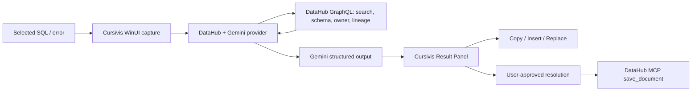

# Cursivis DataOps

**A context-native AI data agent that turns selected SQL, schemas, and pipeline errors into DataHub-grounded answers and safe actions.**

AI can repair syntax from a snippet, but it cannot know which table is authoritative, what a field means, who owns it, what feeds it, what depends on it, or what the organization already learned. Cursivis DataOps starts at the selection a data practitioner is already working on. For data-aware selections, it retrieves evidence from DataHub, asks Gemini to reason over that evidence, and returns a result that can be copied, inserted, or safely reviewed.

## Why DataHub changes the answer

Without DataHub, Gemini sees only `analytics.customers` and guesses whether `tier` or `lifetime_value` exist. With DataHub, it resolves the catalog entity first and supplies its actual schema, description, ownership, and lineage to the model. The answer can say which governed field to use, which owner should review a semantic change, and what downstream assets may be affected. If DataHub is unavailable or no asset resolves, Cursivis refuses to present a DataHub-grounded answer.

```text
Select → Cursivis → DataHub context → Gemini → Grounded result → Take action → Save reviewed knowledge
```

## Golden workflow

1. Select [examples/broken-query.sql](examples/broken-query.sql) in any Windows editor and invoke Cursivis.
2. The provider detects `FROM analytics.customers`, searches DataHub, and retrieves the matching dataset’s schema, ownership, and lineage.
3. Gemini returns a JSON-schema-validated Cursivis result. See the matching [context](examples/datahub-context.json), [corrected SQL](examples/corrected-query.sql), and [impact report](examples/impact-report.md).
4. Use Cursivis’ existing Copy, Insert, or Replace controls. They act only on the captured local target.
5. Review the finding and explicitly save it to DataHub as a context document through the official MCP server’s `save_document` tool. Never overwrite metadata automatically.

## Architecture



### DataHub integration

The runtime integration is the official DataHub GraphQL API, chosen for a small, reliable Windows deployment: no local agent framework needs to be embedded in the desktop application. It reads catalog search, dataset schema, descriptions, ownership, and lineage supplied by the DataHub entity response. The documented write path uses DataHub MCP’s `save_document` mutation, which is explicitly confirmed and creates durable investigation knowledge instead of silently editing business metadata. DataHub is not just prompt text: it is the live organizational source of truth and can fail independently and visibly.

The official MCP server is also the safest portable write-back mechanism. It exposes `save_document` as a mutation tool and marks mutations for confirmation. Configure `TOOLS_IS_MUTATION_ENABLED=true` only in the self-hosted MCP process and save [examples/resolution-example.md](examples/resolution-example.md) after review.

### Gemini integration

The active Cursivis selected-context provider uses the Gemini Developer API’s JSON-schema structured output. `gemini-2.5-flash` is the default and `GEMINI_MODEL` can override it. `GEMINI_API_KEYS` supports a comma/semicolon-separated development fallback list only for temporary `429`/server failures; it never retries a rejected key and never logs keys.

Voice/realtime code inherited from Cursivis remains isolated and optional; the hackathon SQL flow has no OpenAI requirement.

## Quick setup (Windows)

Prerequisites: Windows 10/11, .NET SDK 8, Docker Desktop, Python 3.10+ (for the DataHub CLI), and a Gemini Developer API key.

```powershell
Copy-Item .env.example .env
# Put your own GEMINI_API_KEY in .env; do not commit it.
.\scripts\bootstrap-datahub.ps1
.\scripts\seed-demo-data.ps1
.\scripts\run-demo.ps1
```

`run-demo.ps1` imports the non-secret values from `.env` into the current process, checks DataHub health, builds, then launches the unpackaged WinUI executable. You can instead set these as process environment variables in your shell:

| Variable | Required | Purpose |
| --- | --- | --- |
| `GEMINI_API_KEY` | Yes | Gemini Developer API key |
| `GEMINI_API_KEYS` | No | Comma/semicolon-separated temporary-fallback keys |
| `GEMINI_MODEL` | No | Defaults to `gemini-2.5-flash` |
| `DATAHUB_GRAPHQL_URL` | Yes for data selections | Defaults to `http://localhost:9002/api/graphql` |
| `DATAHUB_TOKEN` | No for local quickstart | DataHub bearer token |

## DataHub local demo

`bootstrap-datahub.ps1` installs the DataHub CLI in an isolated virtual environment under `.tools` and runs the official Docker quickstart. `seed-demo-data.ps1` imports DataHub’s supported demo metadata bundle. The `examples/` files are the deterministic story used in the demo; use your catalog as the runtime source of truth.

For a local MCP write-back endpoint, follow DataHub’s self-hosted MCP server documentation with `DATAHUB_GMS_URL` and `DATAHUB_GMS_TOKEN`, enable mutations, then invoke `save_document` with the reviewed resolution. This keeps catalog mutation out of Cursivis’ automatic execution path.

## Testing

```powershell
.\scripts\test-all.ps1
```

The suite restores locked dependencies, runs the Release build, deterministic .NET tests, extension validation, and a tracked-file secret scan. It deliberately does not require a Gemini key or Docker. To make a controlled live call, set `CURSIVIS_RUN_LIVE_TESTS=1` and your own `GEMINI_API_KEY`; do not print the key.

## Troubleshooting

- **Docker is not running:** start Docker Desktop, then rerun `bootstrap-datahub.ps1`.
- **DataHub unavailable:** wait for `http://localhost:9002` to respond, then rerun the script. Cursivis will show a catalog-unavailable error instead of fabricating grounding.
- **No catalog entity found:** select a query with a fully qualified `FROM` or `JOIN` reference that exists in your catalog.
- **Gemini key missing/rejected:** set `GEMINI_API_KEY` in the current process or `.env`. Authentication errors are not retried with fallback keys.
- **Port 9002 is occupied:** set `DATAHUB_GRAPHQL_URL` to your DataHub UI/proxy GraphQL endpoint.

## Repository map

- `apps/windows/` — Cursivis WinUI application, selection capture, result panel, safe actions
- `src/Cursivis.Infrastructure.OpenAI/DataHubGeminiResponsesGateway.cs` — Gemini provider and DataHub-first grounding boundary
- `scripts/` — reproducible bootstrap, demo, and validation commands
- `examples/` — deterministic judge-readable scenario outputs
- `docs/` — demo and Devpost materials

## Security and privacy

No keys are tracked. `.env` is ignored, keys are never logged, selected text is sent only to the configured Gemini API and DataHub endpoint for the user-invoked operation, and catalog write-back requires an explicit user confirmation through DataHub MCP. Run `scripts/check-secrets.ps1` before any commit.

## License

Apache-2.0. See [LICENSE](LICENSE).
