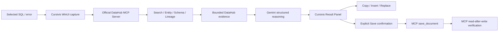

# Cursivis DataOps

**A context-native AI data agent that turns selected SQL and data problems into DataHub-grounded answers, safe actions, and durable organizational knowledge.**

Generic AI can repair syntax from a snippet, but it does not automatically know which table is authoritative, which fields actually exist, who owns the asset, where it came from, or what depends on it. Cursivis DataOps starts at the selection a data practitioner is already working on, reads the organization's live DataHub context through the **official DataHub MCP Server**, asks Gemini to reason only over that evidence, and returns an answer the user can act on without leaving the current workflow.

> **Generic AI understands the code. Cursivis DataOps understands the organization's data behind the code.**

## Why DataHub changes the answer

Without DataHub, Gemini sees `analytics.customers` and can only guess whether `tier` or `lifetime_value` exist. With DataHub MCP, Cursivis resolves the real asset first and retrieves its schema, descriptions, ownership, related knowledge, and lineage. Gemini can then identify governed fields, show who owns the asset, and warn about downstream blast radius before a change is made.

If DataHub MCP is unavailable or the asset cannot be resolved confidently, Cursivis fails closed instead of presenting an ungrounded answer as organizational truth.

```text
Select SQL / error
      ↓
Cursivis capture
      ↓
DataHub MCP Server
 search → get_entities → list_schema_fields → get_lineage
      ↓
Bounded organizational evidence
      ↓
Gemini structured reasoning
      ↓
Grounded result
      ↓
Copy / Insert / Replace
      ↓
Confirm Save → MCP save_document → MCP read-after-write
```

## Golden workflow

1. Start local DataHub OSS/Core and the deterministic demo environment.
2. Select [`examples/broken-query.sql`](examples/broken-query.sql) in any Windows editor and invoke Cursivis.
3. Cursivis extracts `analytics.customers` from the selected SQL.
4. The runtime launches the official DataHub MCP Server and calls `search`, `get_entities`, `list_schema_fields`, and `get_lineage` against the live catalog.
5. Gemini receives only that bounded DataHub evidence and returns JSON-schema-validated output.
6. Cursivis surfaces the corrected SQL, DataHub evidence, ownership, and impact information in the result experience.
7. Use Copy, Insert, or Replace on the captured local target.
8. To preserve a reviewed resolution, click **Save to DataHub** and then **Confirm Save**. Cursivis calls the official MCP `save_document` mutation, links the document to the grounded dataset, and calls `get_entities` to verify the write before showing success.

The canonical demo intentionally makes the selected SQL wrong: `lifetime_value` and `tier` do not exist. DataHub shows that the governed fields are `lifetime_value_usd` and `customer_tier`, and also exposes the downstream blast radius.

## Architecture



### DataHub technologies used

- **DataHub OSS / Core Platform** — local catalog and source of truth.
- **DataHub MCP Server** — the judge-facing agent's runtime read and write interface.
- **DataHub Python SDK** — deterministic local demo seeding and setup verification only.

The runtime agent does **not** substitute tracked example JSON for DataHub. For grounded requests, catalog evidence comes from MCP tools. The Python SDK/GraphQL setup helpers remain useful for creating and verifying the deterministic local catalog before the app launches.

The official MCP process is launched over stdio using `mcp-server-datahub`. Read tools run with mutations disabled. Only the explicit Save flow starts MCP with mutation tools enabled, and no write occurs until the user confirms it in the Cursivis UI.

### Gemini integration

The active selected-context provider uses the Gemini Developer API's structured JSON output. `gemini-2.5-flash` is the default and `GEMINI_MODEL` can override it. `GEMINI_API_KEYS` supports a comma/semicolon-separated development fallback list for temporary `429`/server failures; authentication failures are not rotated across keys and keys are never logged.

Voice/realtime code from the broader Cursivis codebase remains isolated and optional. The hackathon SQL/DataHub flow has **no OpenAI API-key requirement**. The primary desktop settings surface is **AI & DataHub**.

## Quick setup (Windows)

Prerequisites: Windows 10/11, .NET SDK 8, Docker Desktop, **Python 3.11+**, and a Gemini Developer API key.

```powershell
Copy-Item .env.example .env
# Put your own GEMINI_API_KEY in .env; never commit it.
.\scripts\bootstrap-datahub.ps1
.\scripts\seed-demo-data.ps1
.\scripts\run-demo.ps1
```

`bootstrap-datahub.ps1` creates an isolated environment under `.tools`, installs DataHub CLI + `uv`, starts the official DataHub Docker quickstart, and makes the official MCP launcher available. `seed-demo-data.ps1` creates and verifies the canonical catalog. `run-demo.ps1` loads local non-secret configuration, verifies the catalog, configures the MCP launcher, builds Release, and starts Cursivis.

| Variable | Required | Purpose |
| --- | --- | --- |
| `GEMINI_API_KEY` | Yes | Gemini Developer API key |
| `GEMINI_API_KEYS` | No | Temporary-fallback Gemini keys for retryable failures |
| `GEMINI_MODEL` | No | Defaults to `gemini-2.5-flash` |
| `DATAHUB_GMS_URL` | Local default provided | MCP Server target; local default `http://localhost:8080` |
| `DATAHUB_GMS_TOKEN` | Authenticated instances only | Preferred MCP bearer token |
| `DATAHUB_TOKEN` | No for local quickstart | Compatibility token for DataHub helpers |
| `DATAHUB_GRAPHQL_URL` | Setup helpers only | Used by deterministic verification tooling, not judge-facing grounding |
| `DATAHUB_MCP_COMMAND` | Normally automatic | Trusted MCP launcher; `run-demo.ps1` points this to isolated `uvx.exe` |
| `DATAHUB_MCP_PACKAGE` | No | Defaults to `mcp-server-datahub@latest` |

The DataHub UI is normally available at `http://localhost:9002`; local GMS is normally at `http://localhost:8080`.

## Deterministic demo catalog

`scripts/seed_demo_data.py` creates:

```text
raw.customers
      |
      v
analytics.customers
      |------------------------------|
      v                              v
analytics.executive_revenue   ml.churn_prediction_features
```

The canonical `analytics.customers` schema contains:

- `customer_id`
- `lifetime_value_usd`
- `customer_tier`
- `updated_at`

The seed defines descriptions, ownership, and lineage, then verifies the metadata exists and the canonical dataset is searchable before setup reports success. If verification fails, the demo fails rather than continuing with fake context.

## Safety and write-back

Cursivis never silently mutates the catalog. **Save to DataHub** is intentionally a two-step UI action:

1. first click arms the mutation and previews the intent,
2. second click explicitly confirms the save,
3. MCP `save_document` creates the durable resolution linked to the grounded asset,
4. MCP `get_entities` reads the new document back,
5. Cursivis shows success only after verification.

This turns DataHub into durable organizational memory without treating every AI response as trusted knowledge.

## Testing

```powershell
.\scripts\test-all.ps1
```

The deterministic suite restores locked dependencies, runs the Release build, .NET tests, extension validation, and a tracked-file secret scan. It does not require live Gemini credentials or Docker, so CI remains deterministic. Live DataHub/Gemini/MCP verification is intentionally a separate golden-flow check because CI must not contain user secrets.

## Troubleshooting

- **Docker is not running:** start Docker Desktop, then rerun `bootstrap-datahub.ps1`.
- **Python is too old:** install Python 3.11+; the official DataHub MCP package currently requires it.
- **MCP launcher missing:** rerun `bootstrap-datahub.ps1`; it installs `uvx` inside `.tools/datahub-venv`.
- **DataHub UI unavailable:** wait for `http://localhost:9002` after quickstart.
- **DataHub GMS unavailable:** verify `http://localhost:8080` and rerun the seed script.
- **Demo seed fails:** do not continue; the script intentionally fails if required schema/ownership/lineage/searchability is missing.
- **No catalog entity found:** select SQL with a qualified `FROM` or `JOIN` reference that exists in the catalog.
- **Gemini key missing/rejected:** set `GEMINI_API_KEY` in the process, secure app settings, or `.env` for the development demo.
- **Authenticated DataHub:** configure `DATAHUB_GMS_URL` and `DATAHUB_GMS_TOKEN`/`DATAHUB_TOKEN` as required by the instance.

## Judge-readable artifacts

See [`examples/`](examples/) for the canonical broken query, corrected SQL, DataHub context, impact report, and reviewed resolution example. These are evaluation aids; the runtime golden flow still reads live DataHub metadata through MCP.

## Repository map

- `apps/windows/` — WinUI application, selection capture, result panel, confirmation and safe actions
- `src/Cursivis.Infrastructure.OpenAI/DataHubMcpClient.cs` — minimal stdio client for the official DataHub MCP Server
- `src/Cursivis.Infrastructure.OpenAI/DataHubGeminiMcpResponsesGateway.cs` — MCP-grounded Gemini reasoning + confirmed MCP write-back
- `scripts/seed_demo_data.py` — deterministic DataHub catalog seed and verification
- `scripts/` — bootstrap, demo, build, and validation commands
- `examples/` — judge-readable canonical scenario artifacts
- `docs/` — demo and submission materials

## Security and privacy

No API keys are tracked. `.env` is ignored. Keys are not written to stdout/stderr or application logs. The MCP server receives its DataHub configuration through the child-process environment, and its diagnostic stderr is deliberately drained without being persisted by Cursivis. Selected content is sent only to the configured DataHub MCP/DataHub instance and Gemini for the user-invoked operation.

Run `scripts/check-secrets.ps1` before any commit.

## Hackathon disclosure

See [HACKATHON_DISCLOSURE.md](HACKATHON_DISCLOSURE.md) for the disclosure of pre-existing Cursivis interaction-layer infrastructure versus the DataHub/Gemini hackathon work.

## License

Apache-2.0. See [LICENSE](LICENSE).
