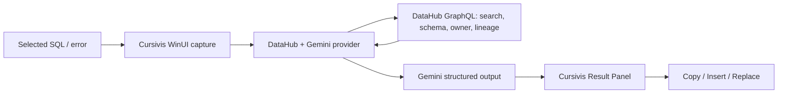

# Cursivis DataOps

**A context-native AI data agent that turns selected SQL, schemas, and pipeline errors into DataHub-grounded answers and safe actions.**

AI can repair syntax from a snippet, but it cannot know which table is authoritative, what a field means, who owns it, what feeds it, what depends on it, or what the organization already learned. Cursivis DataOps starts at the selection a data practitioner is already working on. For data-aware selections, it retrieves evidence from DataHub, asks Gemini to reason over that evidence, and returns a result that can be copied, inserted, or safely reviewed.

## Why DataHub changes the answer

Without DataHub, Gemini sees only `analytics.customers` and guesses whether `tier` or `lifetime_value` exist. With DataHub, it resolves the catalog entity first and supplies its actual schema, ownership, descriptions, and lineage to the model. The answer can identify governed fields, show who owns the asset, and warn about downstream consumers before a change is made. If DataHub is unavailable or no asset resolves, Cursivis refuses to present a DataHub-grounded answer.

```text
Select → Cursivis → DataHub context → Gemini → Grounded result → Take action
```

## Golden workflow

1. Start DataHub and seed the deterministic demo catalog with `scripts/seed-demo-data.ps1`.
2. Select [examples/broken-query.sql](examples/broken-query.sql) in any Windows editor and invoke Cursivis.
3. The provider detects `FROM analytics.customers`, searches the live DataHub catalog, and retrieves the matching dataset's real schema, ownership, and downstream lineage.
4. Gemini receives that bounded organizational context and returns a JSON-schema-validated Cursivis result.
5. Compare the live result with the judge-readable [context](examples/datahub-context.json), [corrected SQL](examples/corrected-query.sql), and [impact report](examples/impact-report.md).
6. Use Cursivis' existing Copy, Insert, or Replace controls. They act only on the captured local target.

The deterministic catalog intentionally makes the selected SQL wrong: `lifetime_value` and `tier` do not exist. DataHub shows the governed fields are `lifetime_value_usd` and `customer_tier`, and also exposes the downstream blast radius.

## Architecture



### DataHub integration

The runtime integration uses DataHub's GraphQL API for catalog search, dataset schema, ownership, descriptions, and lineage. DataHub is not tracked prompt text or a fake fixture: it is the live organizational source of truth and can fail independently and visibly.

The local demo is seeded through DataHub's Python SDK. `scripts/seed_demo_data.py` creates four small datasets, schema metadata, ownership, and lineage, then reads the metadata back and waits until the same catalog search used by Cursivis can resolve `analytics.customers`. The PowerShell wrapper fails if that verification fails.

The canonical demo graph is:

```text
raw.customers
      |
      v
analytics.customers
      |------------------------------|
      v                              v
analytics.executive_revenue   ml.churn_prediction_features
```

The repository contains an example reviewed resolution for the planned durable knowledge/write-back flow, but the primary runtime claim today is DataHub-grounded read/reason/act. Do not assume a write-back occurred unless the configured DataHub mutation path reports success.

### Gemini integration

The active selected-context provider uses the Gemini Developer API's structured JSON output. `gemini-2.5-flash` is the default and `GEMINI_MODEL` can override it. `GEMINI_API_KEYS` supports a comma/semicolon-separated development fallback list only for temporary `429`/server failures; authentication failures are not retried across keys and keys are never logged.

Voice/realtime code from the broader Cursivis codebase remains isolated and optional; the hackathon SQL/DataHub flow has no OpenAI API-key requirement. In the desktop settings navigation, the hackathon-facing provider surface is labeled **AI & DataHub**.

## Quick setup (Windows)

Prerequisites: Windows 10/11, .NET SDK 8, Docker Desktop, Python 3.10+, and a Gemini Developer API key.

```powershell
Copy-Item .env.example .env
# Put your own GEMINI_API_KEY in .env; do not commit it.
.\scripts\bootstrap-datahub.ps1
.\scripts\seed-demo-data.ps1
.\scripts\run-demo.ps1
```

`bootstrap-datahub.ps1` creates an isolated DataHub CLI environment under `.tools` and starts the official Docker quickstart. `seed-demo-data.ps1` creates and verifies the canonical demo catalog. `run-demo.ps1` loads the non-secret configuration, verifies/seeds DataHub again, builds Release, and launches the unpackaged WinUI application.

| Variable | Required | Purpose |
| --- | --- | --- |
| `GEMINI_API_KEY` | Yes | Gemini Developer API key |
| `GEMINI_API_KEYS` | No | Comma/semicolon-separated temporary-fallback keys |
| `GEMINI_MODEL` | No | Defaults to `gemini-2.5-flash` |
| `DATAHUB_GMS_URL` | No for local quickstart | Defaults to `http://localhost:8080` |
| `DATAHUB_GRAPHQL_URL` | Yes for grounded data selections | Defaults to `http://localhost:8080/api/graphql` |
| `DATAHUB_TOKEN` | No for unauthenticated local quickstart | DataHub bearer token |

The DataHub web UI is normally available at `http://localhost:9002`; Cursivis talks to the GMS GraphQL endpoint on port `8080` by default.

## Deterministic demo catalog

`scripts/seed_demo_data.py` creates:

- `raw.customers`
- `analytics.customers`
- `analytics.executive_revenue`
- `ml.churn_prediction_features`

The canonical `analytics.customers` schema contains:

- `customer_id`
- `lifetime_value_usd`
- `customer_tier`
- `updated_at`

It is owned by the local DataHub user and has one upstream and two downstream relationships. The seed script verifies dataset read-back, required schema fields, ownership, downstream lineage, and search indexing before it prints success.

## Testing

```powershell
.\scripts\test-all.ps1
```

The deterministic suite restores locked dependencies, runs the Release build, .NET tests, extension validation, and a tracked-file secret scan. It deliberately does not require a Gemini key or Docker. Live DataHub/Gemini verification is separate so CI does not need secrets.

## Troubleshooting

- **Docker is not running:** start Docker Desktop, then rerun `bootstrap-datahub.ps1`.
- **DataHub UI unavailable:** wait for `http://localhost:9002` after quickstart.
- **DataHub GMS unavailable:** verify `http://localhost:8080`, then rerun the seed script.
- **Demo seed fails:** do not continue with the video; the script intentionally fails if schema, ownership, lineage, or search resolution is missing.
- **No catalog entity found:** select SQL with a qualified `FROM` or `JOIN` reference that exists in the catalog.
- **Gemini key missing/rejected:** set `GEMINI_API_KEY` in the process or `.env`. Authentication errors are not retried with fallback keys.
- **Custom DataHub deployment:** set `DATAHUB_GMS_URL`, `DATAHUB_GRAPHQL_URL`, and `DATAHUB_TOKEN` as required by that instance.

## Repository map

- `apps/windows/` — Cursivis WinUI application, selection capture, result panel, safe actions
- `src/Cursivis.Infrastructure.OpenAI/DataHubGeminiResponsesGateway.cs` — Gemini provider and DataHub-first grounding boundary
- `scripts/seed_demo_data.py` — deterministic DataHub catalog seed and verification
- `scripts/` — bootstrap, demo, build, and validation commands
- `examples/` — judge-readable canonical scenario artifacts
- `docs/` — demo and Devpost materials

## Security and privacy

No keys are tracked. `.env` is ignored, keys are never logged, and selected text is sent only to the configured Gemini API and DataHub endpoint for the user-invoked operation. Run `scripts/check-secrets.ps1` before any commit.

## Hackathon disclosure

See [HACKATHON_DISCLOSURE.md](HACKATHON_DISCLOSURE.md) for the required disclosure of pre-existing Cursivis interaction-layer work versus the DataHub/Gemini hackathon work.

## License

Apache-2.0. See [LICENSE](LICENSE).
